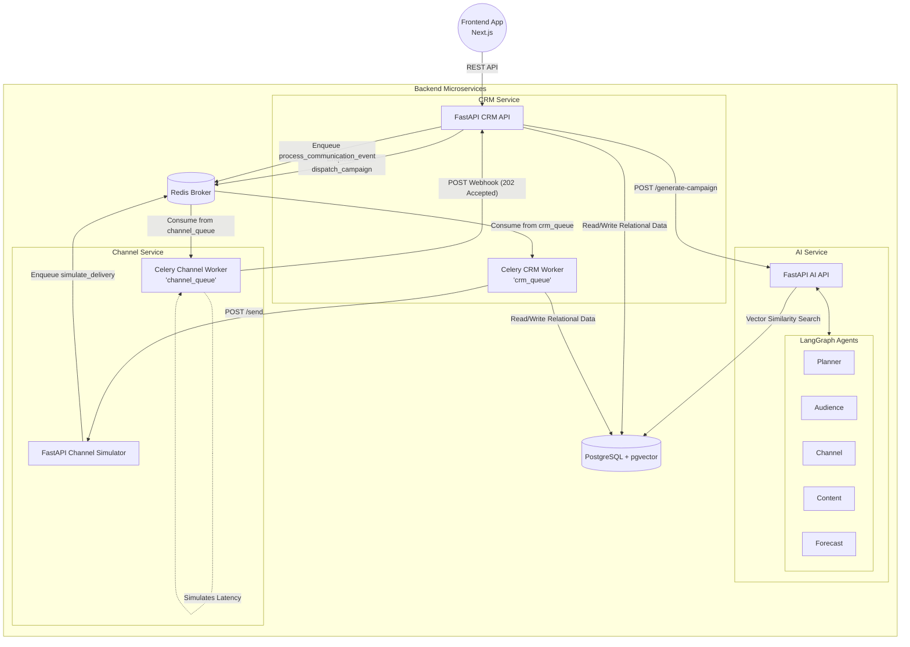

# SmartReach AI Architecture Audit

## Overview
SmartReach AI is an intelligent marketing and customer relationship platform. It generates AI-driven marketing campaigns, determines optimal target audiences, and automates communication rollouts across simulated channels (WhatsApp, Email, SMS).

## Architecture Diagram
The following Mermaid diagram maps out the core communication patterns and component structures of the system:

## Component Audit

### 1. Frontend Client
- **Tech Stack:** Next.js, React, TypeScript.
- **Responsibility:** Provides the UI for managing users, launching campaigns, tracking real-time analytics, and observing agent decision timelines.

### 2. CRM Service
- **Tech Stack:** FastAPI, SQLAlchemy (asyncpg), Celery.
- **Responsibility:** The central orchestrator. It manages CRUD for users, orders, and campaigns.
- **Worker Queues:** Binds specifically to `crm_queue`. Responsible for dispatching messages (`dispatch_campaign`), calculating RFM metrics (`refresh_rfm_segments`), and aggregating analytics (`refresh_campaign_analytics`, `process_communication_event`).

### 3. AI Service
- **Tech Stack:** FastAPI, LangGraph, Google Gemini, pgvector.
- **Responsibility:** Takes a high-level goal (e.g. "Bring back dormant customers") and generates an end-to-end campaign through an acyclic graph of AI agents:
  - **Planner Agent:** Formulates strategy.
  - **Audience Agent:** Identifies the right customer segment.
  - **Channel Agent:** Selects optimal communication channels.
  - **Content Agent:** Drafts messaging.
  - **Forecast Agent:** Predicts open rates, CTR, and conversion.
- **Vector DB:** Uses `pgvector` with 768-dimensional embeddings to perform RAG (Retrieval-Augmented Generation) on past marketing knowledge.

### 4. Channel Service (Simulator)
- **Tech Stack:** FastAPI, Celery.
- **Responsibility:** Simulates third-party communication providers (like Twilio or SendGrid).
- **Worker Queues:** Binds specifically to `channel_queue`. Processes simulated message delivery events (`simulate_delivery`) with realistic random latency jitter, ultimately firing asynchronous webhooks back to the CRM API to close the analytics loop.

### 5. Infrastructure
- **PostgreSQL (`pgvector`):** Dual-purpose relational store for customer data/orders and vector store for AI embeddings.
- **Redis:** Serves as the high-speed task broker for both `crm_queue` and `channel_queue`, alongside acting as a Celery result backend and providing idempotency caching for webhooks to prevent duplicate event processing.

## Campaign Lifecycle
1. **Creation:** User requests a campaign on the Frontend -> CRM relays to AI Service. AI Service runs its multi-agent graph to build the campaign details.
2. **Launch:** CRM Service queues `dispatch_campaign`. The CRM Worker gathers the targeted audience cohort based on RFM filters, constructs the payload, and sends POST requests to the Channel Service.
3. **Simulation:** The Channel Service drops these into `channel_queue`. The Channel Worker simulates network latency (often 1–2 minutes).
4. **Resolution:** Upon "delivery", the Channel Worker sends a Webhook to the CRM API. The CRM API idempotently queues the event, which is picked up by the CRM Worker to increment `delivered`, `opened`, `clicked`, etc., ultimately reflecting in the Frontend UI metrics.
